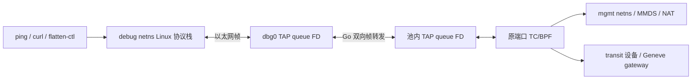
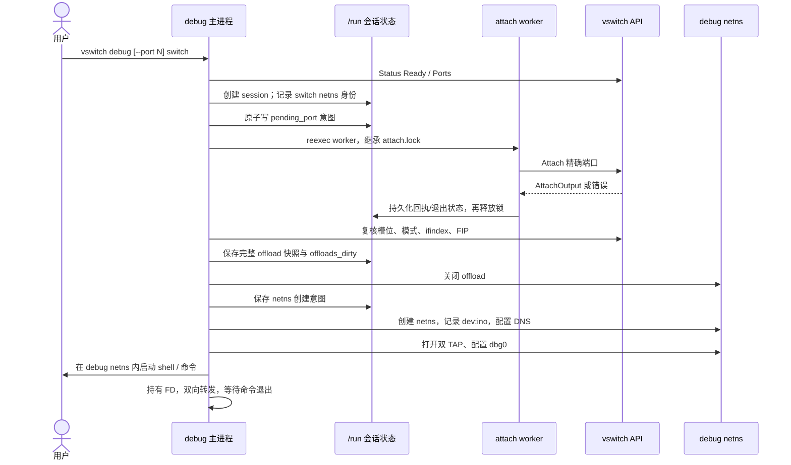
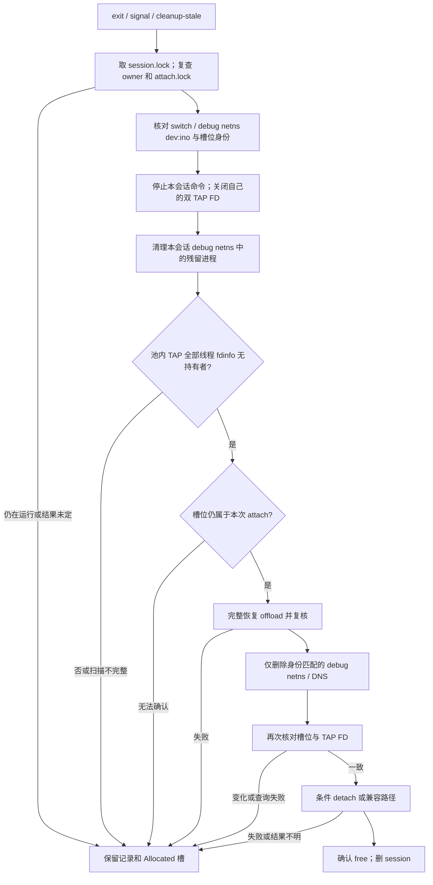

# TAP 调试工具 Go 版设计

状态：已实现（含 UT 与私有 switch E2E 验证）；入口见
[`cmd/connector-ctl/debug.go`](../cmd/connector-ctl/debug.go)，生命周期与转发见
[`pkg/debug/`](../pkg/debug)，测试见
[`test/e2e/vswitch_debug_test.py`](../test/e2e/vswitch_debug_test.py)。基线是当前
[`vswitch-tap-debug.sh`](../scripts/vswitch-tap-debug.sh) 和
[`操作与测试手册`](vswitch-tap-debug_zh.md)；Python 标准库备选方案见
[`vswitch-tap-debug-python-design_zh.md`](vswitch-tap-debug-python-design_zh.md)。
目标是在纯 TAP switch 上以 debug netns 模拟沙箱网络，覆盖管理网、MMDS 和
transit/Geneve，并使调试会话不挤占正常沙箱的前排端口，也不误释放别人的端口。

## 结论与依赖边界

建议集成到现有 `connector-ctl`：

```text
connector-ctl vswitch debug [--port N] [switch] [-- command args...]
connector-ctl vswitch debug --list
connector-ctl vswitch debug --cleanup-stale
```

不提供 switch 时，节点上只有一个 switch 就自动选择；有多个时从终端选择，非交互调用则报错并列出候选。
不带 `-- command` 时直接进入交互 Bash；`exit` 清理会话。`--help` 用英文，
默认值和现行脚本一致。第一版保持脚本的尾部选口、DNS、proxy、transit 参数及
独立的 `/run/connector-debug` 恢复目录。`--list` 只读本地状态，switch 故障时
也能使用。

已有的 `github.com/vishvananda/netlink`、`github.com/vishvananda/netns`、
`golang.org/x/sys/unix` 和 `github.com/spf13/cobra` 足以实现；**不新增 Go
模块**。目标交付物运行时不调用 `socat`、`nsenter`、`ip`、`jq`、`flock`、
`timeout` 或 `ethtool` 二进制。交互 Bash 及用户自己执行的 `ping`、`curl`、
`flatten-ctl` 仍是宿主命令。尤其不能把“无 ethtool 命令”理解为“无需 offload
处理”：必须先实现等价的内核 feature 快照、修改和复核。

## 数据路径



两端 FD 使用 `IFF_TAP | IFF_NO_PI`，不使用 `IFF_VNET_HDR`。Go 只按帧转发，
不解析 TCP/UDP，也不封装 Geneve；Geneve 由现有 connector BPF 路径产生。
关闭池内 TAP 的 tx/tso/gso 能让无 virtio 头的回包带有完成的校验和，避免现有
PoC 中 ICMP 可通、TCP 不通的问题。打开 debug TAP 前复制池内 TAP 的 MTU；
MAC 使用 attach 输出中的 `port_mac`，IP/CIDR、网关和 DNS 使用对应环境参数。

Geneve 验证需在 attach 时复用故障沙箱的 transit gateway、VNI、MAC（以及
已配置的 Geneve options），访问实际走 transit 的目的地址，并核对端口的
transit tx/rx、外层 Geneve 报文/VNI 和双向 TCP/UDP 应用结果。MMDS/VIP
探测只覆盖管理路径。

## 模块划分与现有代码复用

| 组件 | 拟放位置 | 职责 |
| --- | --- | --- |
| CLI | `cmd/connector-ctl/debug.go` | Cobra 参数、`run/list/cleanup-stale`、交互命令 |
| switch 选择 | `cmd/connector-ctl/debug_select.go` | 单 switch 自动选择、多 switch 交互选择 |
| 限时清理 | `cmd/connector-ctl/debug_cleanup.go` | 同二进制 worker 执行恢复；超时杀掉 worker，保留会话 |
| 生命周期 | `pkg/debug/session.go`、`recovery.go` | 状态、锁、所有权复核、幂等清理 |
| TAP 转发 | `pkg/debug/bridge.go` | 两个阻塞 TAP FD 的整帧转发、背压、计数 |
| namespace helper | `cmd/connector-ctl/debug_internal.go` | 短命 reexec 子进程建 ns、开 TAP、在 ns 内 exec 命令 |
| offload | `pkg/debug/offload_linux.go` | 原生 ethtool feature 快照、设置、完整恢复 |
| 端口租约（后续接口） | `pkg/vswitch`、`pkg/internal/bpfmap` | 分配代次与原子条件 detach |

在隔离 worker 中直接调用 `vswitch.Open`、`Status`、`Ports`、`Attach`、`Detach`，不通过再次启动
公开的 `connector-ctl vswitch` 子命令解析 JSON。普通沙箱既有 attach/detach 路径不因 debug
模式改变语义。`pkg/tapfd.OpenTap(name, unix.IFF_NO_PI)` 已有 TUNSETIFF 逻辑，
但它要求调用线程已在 TAP 所在 netns；当前实现通过
`pkg/netns.NetNS.Do` 锁定线程、短暂进入相应 netns 打开 FD，再恢复原 netns。
主转发协程在宿主 netns 运行，不依赖额外的 FD 传递进程。

命名 netns 用已依赖的 `vishvananda/netns.NewNamed/DeleteNamed` 创建与删除；
配置 `dbg0` MAC、MTU、地址、路由、link up 和 `lo up` 使用已有 netlink 依赖。
对切换线程 netns 的调用集中在 helper 或 `NetNS.Do`，避免 Go goroutine 在线程
间迁移导致操作落到错误的 netns。主进程不为数据转发调用 `setns`。

## 启动时序



自动选口仍只考虑端口池后半区中最高编号的至多 8 个空闲 TAP 槽，由高到低
精确 attach；没有可用槽即失败，不回落到沙箱顺序分配器的前排槽。显式
`--port` 只尝试指定口。attach 失败后，只有确定是竞争者先占端口、且本次
Attach 不可能已经成功时才能尝试下一候选；超时、进程死亡或回执不完整均
保留 pending 记录。只有 `mode=tap`、真实池内 TAP 存在且 `ifindex` 与槽位
一致才继续。TUNSETIFF 可能在设备不存在时新建 TAP，因此开 FD 前后都要
验证池内设备身份，不能把新建的假 TAP 当成原端口。

worker 必须独立于父进程：它继承 `attach.lock`，调用 vswitch API，写完整
AttachOutput/错误/完成标记并 `fsync`，最后放锁。父进程 SIGKILL 时，恢复程序
看到 worker 仍持锁就不能判断 attach 结果。对可能阻塞的 attach 操作设置有界
等待；若内核调用进入不可中断状态，不能假定超时能杀掉 worker，保留记录和
端口直到确认 worker 真正退出。

## TAP、转发和交互进程

1. 打开池内 TAP 只附加现有设备；debug netns 内的 `dbg0` 可由 TUNSETIFF
   创建非持久 TAP。两侧均不带 PI/virtio 头，以阻塞读写自然形成背压。
2. bridge 每个方向运行一个转发协程：一次读保留一个以太网帧，短写视为
   故障；双向帧和字节计数使用原子操作。缓冲区覆盖 TAP 支持的最大 MTU。
3. 主进程独占两个 TAP FD。短命 helper 和交互命令都不继承它们；父进程被
   SIGKILL/OOM 时，内核关闭 FD，不会留下持有池内 TAP 的 socat 进程。
4. 被测命令通过同一二进制的 `debug internal-exec` reexec helper 启动。
   helper 锁定 OS 线程后切换到 debug netns，创建**私有 mount ns**，先将
   `/` 设为 private，再将 `/etc/netns/<debug_ns>/resolv.conf` bind mount 到
   `/etc/resolv.conf`，最后 `unix.Exec` 用户命令。这样 DNS 与当前
   `ip netns exec` 的约定一致；单纯 `setns(CLONE_NEWNET)` 不足以模拟 DNS。
   helper 不接受来自普通 CLI 的任意 FD/路径参数，避免内部入口被误用。
5. 交互模式执行 `bash --noprofile --norc`，继承终端 stdio，设置
   `PS1=debug:<switch>:<port>$ `；默认删除宿主代理环境变量。主进程同时
   等待命令退出与 bridge 错误。INT/TERM/HUP 触发有限时长的终止和清理；
   bridge 异常必须结束命令，不能留下看似可用的 shell。

## offload 原生实现

现有脚本会先保存完整 `ethtool -k`，标记 dirty，然后临时关闭池内 TAP 的
tx/tso/gso，最后按实际差异多轮恢复。Go 版保留这个**先落盘、后修改**顺序。
首选使用内核 ethtool netlink 的 `FEATURES_GET/FEATURES_SET`：快照 HW、
WANTED、ACTIVE、NOCHANGE 位集；修改时只指定 tx/tso/gso 所需的位；恢复时
按快照设置可修改位，再重新读取并比较 ACTIVE/WANTED。依赖位例如
`tx-tcp-mangleid-segmentation` 也必须恢复。若目标内核对 ethtool netlink
支持不足，可在 Go 内实现 `SIOCETHTOOL` 的 `GFEATURES/SFEATURES` ioctl
兼容层；**不退化为只恢复三个汇总位**。上述接口均用已有 `x/sys/unix` 与
标准库实现，无新增模块。内核提供的 feature 位集及设置语义以
[Linux ethtool netlink 文档](https://cdn.kernel.org/doc/html/latest/networking/ethtool-netlink.html#features-get) 为准。

读取、修改、恢复每一步都需有限重试与复核。快照缺失、读取失败、恢复不全或
不能确认池内 TAP 无其他 FD 持有者时，**保持槽位 Allocated 并保留恢复记录**。
若 offload 原生实现尚未通过私有 switch 上的完整前后对比，Go 命令不能用于
现网；可以先在测试模式允许调用现有 `ethtool`，但此模式不算无二进制依赖的
目标交付物。

## 会话状态与清理

会话目录使用 `/run/connector-debug/session.<random>`，权限 0700；与 Bash 版状态目录隔离。状态采用
版本化 JSON，写临时文件、`fsync`、`rename`、`fsync` 目录；锁使用始终不替换的
独立 `session.lock` 文件，由 `unix.Flock` 加锁并限制等待。`attach.lock`
专管 worker；`--list` 可无锁读取原子状态快照。记录至少包括 owner PID+启动
时刻、创建时间、switch/netns 的 `dev:ino`、pending port、已分配端口、
TAP 名称/ifindex、inner IP/FIP、offload 快照与 dirty 标志、子进程 PID+启动
时刻、清理阶段、`ownership_lost` 粘性标志。



扫描池内 TAP FD 应覆盖 `/proc/<pid>/task/<tid>/fdinfo/*`，检查 `iff:\t<tap>`；
只看进程组长的 `/proc/<pid>/fdinfo` 可能遗漏其他线程持有的队列 FD。PID 对比
同时验证 `/proc/.../stat` 的启动时刻，并用 pidfd 发信号，避免 PID 复用；扫描异常按“不能确认空闲”
处理。若发现非本会话持有者，写入 `ownership_lost`，之后自动清理也不再修改
池内 TAP offload 或释放槽位。debug netns 名称若被同名重建，只能清理可验证
属于原 netns 的进程；新 netns 不删除。

`/run` 不保证重启后保留。此协议保证**进程异常退出**后的可恢复性；节点重启
后的槽位与设备须重新核验，不能把目录消失等同于端口已释放。任何 cleanup
阶段失败都保留会话记录，`--cleanup-stale` 幂等重试；不靠 `defer` 单独保证
SIGKILL 路径。

## 端口所有权：现有接口的硬边界

当前 `vswitch.Detach` 读取槽位当前 inner IP，再执行 CAS(current IP → free)。
`inner_ip`、`ifindex`、FIP 对固定 profile/端口可以在新一次分配中完全相同。
Go 客户端在 detach 前再读一次槽位，也不能消除“读后被别人释放并用同 IP
重占”的竞态。当前统计 `Generation` 用于流量计数，重置可能失败而 attach
仍成功；它不能直接当端口租约。要获得严格的现网隔离保证，需要 connector
提供以下原子所有权接口：

1. 每次 attach 生成唯一的 128 位 lease ID，返回给调试会话，并在 switch
   仍在运行时持久记录于每槽所有权元数据；所有正常沙箱 attach 也更新该代次。
2. 申请、代次记录、条件释放使用**同一跨进程 switch 控制锁**，并覆盖旧版
   switch，不只覆盖带 Geneve options map 的新 switch。新 attach 在 CAS 之前
   清除旧租约；若进程在中途死亡，缺少租约只能造成保守留口，不能让旧租约
   误释放新占有者。
3. `DetachIfLease(port, leaseID)` 在持锁状态下比较当前 lease ID、slot 状态，
   仅相等时才释放；成功后清除 lease。普通 detach 必须使旧 lease 失效。
4. switch 元数据记录能力版本。没有租约能力的现有 switch 只能使用与 Bash
   相同的保守指纹/FD 检查，并明确存在同 IP、无新 FD 的人工重分配边界；
   严格安全模式应拒绝对这类 switch 自动 detach，不声称 Go 本身解决了竞态。

租约可用专用、随 switch 生命周期管理的 BPF/控制元数据保存；具体存储方案
需与现有 switch pin/升级策略一并评审。它是**独立接口改造**，不能通过新增
一个 debug 命令假装已经具备。调试期间禁止人工 detach 并重分配同一端口，
直至条件释放接口上线。

## 验证计划与交付范围

当前 Go 版可运行的私有环境 E2E 位于
[`test/e2e/vswitch_debug_test.py`](../test/e2e/vswitch_debug_test.py)：

```bash
go build -o /tmp/connector-ctl-debug-e2e ./cmd/connector-ctl
CONNECTOR_CTL=/tmp/connector-ctl-debug-e2e python3 test/e2e/vswitch_debug_test.py
```

用例分别验证管理 VIP 的 ICMP 往返及 offload 完整恢复；活跃调试端口拒绝普通
attach 和第二个 debug、自动选到下一个尾部空闲口，以及 SIGKILL 后缺失快照时
保留端口、补回快照后清理；双 TAP switch 通过隔离的 transit veth 对互通，
两端指定 `--transit-gateway-ip` 与 VNI 100，验证 Geneve 路径 ICMP 往返及
接收侧 transit TX/RX 计数；还验证 attach 分配前失败不留会话、损坏状态导致
`--cleanup-stale` 报错，以及未落盘 inode 的 netns 会保留并报错，避免按名称误删。
测试创建并删除
自己的 switch、netns 和状态目录。

先使用每次测试独占的私有 TAP switch。沿用 Bash 工具的 20 项功能和 14 项
故障注入行为契约，并增加 Go 专项测试：

1. 双 TAP 整帧转发、背压、EAGAIN、短写、MTU 上限、helper 早退；ICMP、
   TCP HTTP、UDP DNS 经过管理网/MMDS。
2. attach 前后、回执前、offload 修改后、shell 运行中、detach 前后注入
   SIGKILL；逐阶段检查 slot、offload、netns、TAP FD、子进程和会话记录。
3. 同 IP 重占且新 VMM 已开 TAP、netns 同名重建、多线程 FD 持有、端口池
   尾部耗尽、并发 debug 和并发 cleanup；不得误释放或污染普通沙箱端口。
4. 专用双 switch 环境验证 Geneve 外层报文/VNI、transit tx/rx 和双向
   TCP/UDP。生产 `e2br0919` 只在单独授权的有界窗口做验证。
5. 原生 offload 操作与原工具逐位对比；在出厂 off 和真沙箱使用过的 TAP
   上分别验证恢复。故障或无法核验时保持 Allocated。

预计实现量：Go debug CLI、helper、桥接、状态/恢复、原生 offload 合计约
**800–1200 行**，有效测试约 **400–600 行**；分配代次与原子条件 detach 是
另一个约 **200–400 行加测试** 的接口改造。这是设计估算，需以兼容旧 switch
与目标内核的 offload 实测结果修正。建议先完成私有 switch 的 Go 数据路径，
再完成恢复协议和 offload，最后决定租约能力上线及现网切换门槛。
