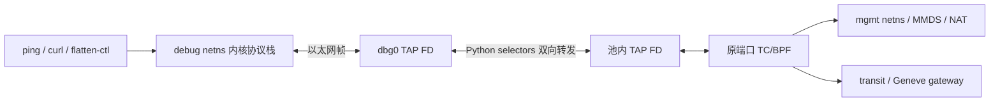
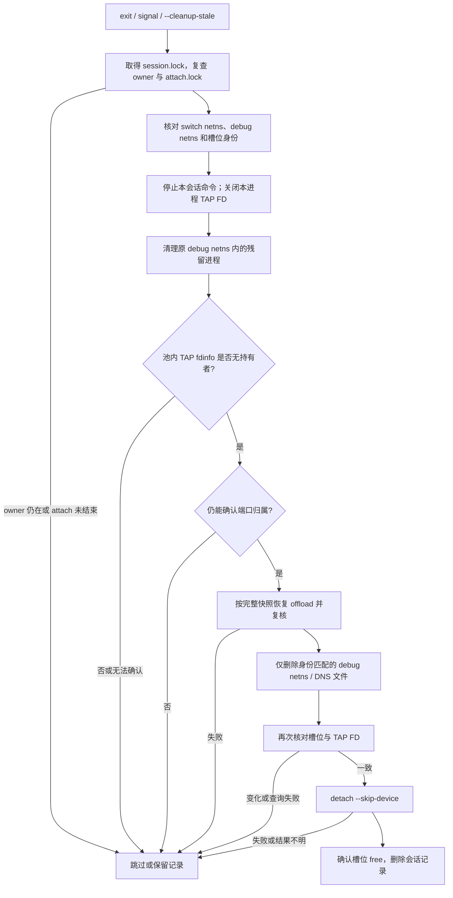

# TAP 调试工具 Python 标准库版设计

状态：设计稿，尚未实现。对应现有
[`scripts/vswitch-tap-debug.sh`](../scripts/vswitch-tap-debug.sh)；现行操作和验证方法见
[`vswitch-tap-debug_zh.md`](vswitch-tap-debug_zh.md)。本文设计完整替换 Bash 编排和
socat 转发，但保持 connector 的 attach/detach 接口及端口池安全策略。

## 选择与边界

Python 3.11 标准库足以实现这一版，**无需 pip 包**。Python 负责参数校验、JSON、
会话记录、进程和锁管理、TAP FD 转发；`ctypes` 仅在一个短命 helper 中调用 libc
`setns(2)`。运行时仍需节点已有的 Python 3、`connector-ctl`、`ip`、`ethtool`、
`bash`（交互模式），以及用户自己调用的 `ping`、`curl`、`flatten-ctl`。不再依赖
`socat`、`nsenter`、`jq`、`flock` 或 GNU `timeout` 命令。

若目标是长期纳入 connector 发布物，Go 更合适：仓库已有 `pkg/netns` 和
`pkg/tapfd`，可构建随 connector 一起部署的单个程序。Python 版的优势是较快复用
现有 CLI 并验证转发方案；**两种语言都无法仅靠客户端消除同一端口、同一 IP 的分配
代次竞态**。现网安全门槛由下面的状态协议和 fail-closed 清理规则决定，而非语言。

## 网络路径



两侧 FD 均使用 `IFF_TAP | IFF_NO_PI`，**不设置 `IFF_VNET_HDR`**。Python 每次
`read` 得到一帧、向另一侧 `write` 一帧；不解析 IP/TCP/UDP，也不自行封装
Geneve。调试 netns 的内核协议栈产生和消费 IP 包；connector 的现有 BPF 数据面
负责管理面转换和 transit Geneve。为了让无 virtio 头的回包校验和完整，沿用现有
脚本的临时 `tx/tso/gso off` 和完整 offload 快照/恢复。

Geneve 验证必须给 attach 传入故障沙箱当时的 gateway、VNI、MAC 等参数，访问
被路由到 transit 的目的地址，并在 gateway 或 transit 设备上核对外层 Geneve、
VNI、端口计数和双向应用响应。仅访问 MMDS/VIP 只能证明管理路径。

## 命令与部署

拟新增 `scripts/vswitch-tap-debug.py`，保持旧脚本使用习惯：

```text
python3 scripts/vswitch-tap-debug.py [--port N] <switch> [command ...]
python3 scripts/vswitch-tap-debug.py --list
python3 scripts/vswitch-tap-debug.py --cleanup-stale
```

没有 `command` 时进入交互 Bash，提示符显示 `debug-tap:<switch>:<port>$ `；
`exit` 触发清理。保留 `CONNECTOR_CTL`、`DEBUG_CIDR`、`DEBUG_GATEWAY`、
`DEBUG_DNS`、`DEBUG_PORT`、`DEBUG_STATE_ROOT`、`DEBUG_TAIL_TRIES`、
`DEBUG_CTL_TIMEOUT`、`DEBUG_KEEP_PROXY` 及三个 `TRANSIT_*` 环境变量。
`--list` 只读取会话目录，不依赖 connector-ctl 在线。

所有子命令使用 `subprocess.Popen(..., shell=False)` 和 argv 数组，不拼接 shell
字符串。为 `connector-ctl`、`ip`、`ethtool` 分别设置调用期限；超时后向子进程组
发送 TERM、再发送 KILL。若无法确认一个可能修改共享状态的子进程已退出，保留
会话与端口，不能以“超时”推断“操作没有生效”。

## TAP 打开与帧转发

主进程始终留在宿主 netns。打开每一侧 TAP 时，启动同一 Python 文件的内部
`open-tap` helper：主进程打开目标 netns FD，并通过 `pass_fds` 交给 helper；
helper 用 `ctypes.CDLL(None, use_errno=True).setns(ns_fd, 0)` 进入目标 netns，
再执行 `os.open('/dev/net/tun', O_RDWR|O_NONBLOCK|O_CLOEXEC)` 与
`fcntl.ioctl(TUNSETIFF, ifreq)`。FD 通过 Unix socket 的 `SCM_RIGHTS` 返回主进程；
helper 退出。这样 `setns` 失败或恢复失败都不会改变主进程所在 netns。内部 helper
只接收已打开的 FD 编号，不接受任意 netns 路径。

打开池内 TAP 前，必须在 switch netns 核对设备存在、名称、模式和 attach 槽位
`ifindex`；打开后再核对一次。否则 `TUNSETIFF` 可能创建一个同名新 TAP，造成
“调试成功、实际未经过端口池”的假象。`dbg0` 只在本会话创建的 debug netns 中
创建，配置为 attach 返回的端口 MAC，并复制池内 TAP 的 MTU。所有转发 FD 设
`CLOEXEC`；交互 shell 和被测命令不得继承 FD。

主进程用 `selectors.DefaultSelector` 处理两个非阻塞 FD，分别维护有界帧队列：

1. 可读时读取一整帧，入对侧队列；队列达到上限时暂停这一方向的读事件，形成
   背压，不静默丢帧。
2. 可写时发送队首**完整帧**；遇 `EAGAIN` 等待下次可写。TAP 写入若返回短写，
   作为转发故障终止会话，不能把余段当作第二帧写入。
3. 读取缓冲区应覆盖支持的最大 MTU，并对超限配置直接拒绝；记录双向帧数、
   字节数和错误数。不能把 TCP 字节流转发逻辑用于 TAP 帧。
4. 事件循环按短周期检查交互命令退出、信号和转发故障。转发故障必须结束被测
   命令并进入清理，不能让用户留在一个已经断链的 debug netns 内。

这部分需要在私有 switch 上实测 TAP 读写和大帧行为后确定缓冲区与队列上限；
设计不能仅凭 ICMP 成功宣称 TCP、UDP 或 Geneve 均已覆盖。

## 建立会话的顺序

```mermaid
sequenceDiagram
    actor User
    participant P as Python 主进程
    participant S as /run 会话记录
    participant W as attach helper
    participant C as connector-ctl
    participant N as debug netns
    User->>P: debug [--port N] switch
    P->>C: status --ready; show slots
    P->>S: 创建 session，记录 owner 与 switch netns 身份
    P->>S: 写 pending_port，持久化 attach 意图
    P->>W: 启动 helper，继承 attach.lock
    W->>C: attach --port=N --inner-ip=...
    C-->>W: JSON / 错误 / 超时
    W->>S: 原子写回执、退出码并释放 attach.lock
    P->>C: show slots，核对端口身份
    P->>S: 保存端口、FIP、ifindex、完整 offload 快照
    P->>N: 创建 netns；写 DNS；记录 netns dev:ino
    P->>S: 先标记 offloads_dirty
    P->>N: 关闭 tx/tso/gso；打开双 TAP FD；配置 dbg0
    P->>User: ip netns exec 内启动 shell 或命令
    P->>P: selectors 双向转发直到命令结束
```

自动分配只枚举端口池后半部分最多 `DEBUG_TAIL_TRIES` 个最高编号的空闲 TAP
槽，按降序尝试；耗尽即失败，不转向正常沙箱从前方扫描的槽。`--port` 必须精确
占用指定空闲槽。attach 的 JSON 用 `json` 标准库解析，核对 port、mode、
port_dev、MAC、FIP；不再用 sed 匹配文本。

attach 由独立 helper 完成，是为了处理主进程在 connector 已完成分配、回执尚未
落盘时被 SIGKILL 的窗口。会话目录先写 `pending_port`；helper 继承独立的
`attach.lock`，写出完整 stdout/stderr/rc 后才释放锁。恢复过程遇到这个锁仍被
持有时立即停下。回执丢失或超时后槽位仍为 Allocated 时，**不得猜测归属并自动
重试或释放**。仅对确认的“端口已被占”拒绝尝试下一候选。

## 会话记录和进程身份

`/run/connector-debug-tap/session.<random>/` 归 root、权限 0700；记录用 JSON
原子替换，文件与目录 `fsync` 后才执行下一项可能分配或修改共享资源的操作。
独立、从创建到删除都不替换的 `session.lock` 用 `fcntl.flock` 加锁；这避免锁住
一个刚被 `os.replace` 替换掉的 JSON inode。`attach.lock` 只保护 attach helper。
会话至少保存：

| 字段 | 用途 |
| --- | --- |
| `schema_version`、`created_at`、`phase` | 兼容旧记录、显示和恢复入口 |
| `owner_pid`、`owner_starttime` | 判断父进程是否仍为本会话，避免 PID 复用 |
| `switch`、`switch_netns`、`switch_ns_dev_ino` | 防止 switch netns 被重建后误操作 |
| `debug_ns`、`debug_ns_dev_ino` | 防止同名 debug netns 被重建后误删除 |
| `pending_port`、`port`、`tap_name`、`inner_ip`、`ifindex`、`floating_ip` | attach 意图与槽位指纹 |
| `offloads_snapshot`、`offloads_dirty` | 恢复前的完整状态和已修改标记 |
| `child_pid`、`child_starttime`、`ownership_lost` | 精确回收进程与粘性防误释放标志 |

`phase` 可取 `preparing → allocated → netns_ready → bridging → cleaning → done`；
失败时保留记录及失败阶段。`ownership_lost` 一旦置位，自动清理不得恢复共享
TAP offload 或 detach。`/run` 是运行时目录：此协议针对进程崩溃和 SIGKILL；
节点重启后的状态要重新从 connector 与设备状态核验，不能声称跨重启持久化。

## 退出与恢复流程



正常退出先让事件循环停止、关闭自身两个 TAP FD，再扫描 `/proc/*/fdinfo`
中的 `iff:\t<tap>`。子进程必须 `close_fds=True`，这样 Python 被 SIGKILL 后
内核也会关闭它持有的 TAP FD，不会留下 socat 式长期占用。若扫描失败，或发现
VMM 等外来持有者，不改 offload、不 detach；把怀疑写成持久的
`ownership_lost`。对本会话创建的 debug netns，只在 `dev:ino` 匹配时杀掉其中
进程并删除；若名字已指向新 netns，仅识别并清理原 netns 内可确认属于本会话
的进程，不碰新 netns。

offload 恢复读取完整 `ethtool -k` 快照，比较每个可读 feature 的实际 on/off，
多轮仅调整差异项，并最终复核实际值；无法确认恢复完成则保留端口。清理最后
再次读取 slot JSON 和 TAP fdinfo，才调用 `detach --skip-device`；detach 超时
或失败时保留记录。后续重试若槽位已 free，可在确认其余本会话资源已清理后
关闭记录；若已被重新分配，必须保留取证记录，不触碰新占有者。

现有 connector 的 detach 只基于当前槽位执行释放，CLI 没有分配代次 token
和原子条件 detach。`inner_ip + ifindex + FIP` 在同 profile 复用时仍可能完全
相同，所以“再次核对后立刻 detach”仍有竞态。**禁止人工先 detach stale debug
口再让沙箱复用**。若要求从接口层消除此风险，需另行给 connector 增加 attach
返回代次、detach 校验代次的原子 API；Python/Go 客户端都不能代替它。

## DNS、交互和信号

创建 `/etc/netns/<debug_ns>/resolv.conf`，写入 `DEBUG_DNS`（默认
`169.254.169.253`）。命令必须经 `ip netns exec <debug_ns>` 启动，使该文件
按 iproute2 的约定映射到命令看到的 `/etc/resolv.conf`；只调用 `setns` 不足以
模拟 guest 的 DNS。默认移除宿主代理环境变量，保留显式 `DEBUG_KEEP_PROXY`。
交互 shell 与 Python 共用终端；Python 捕捉 INT/TERM/HUP 后通知命令退出，
并以有限期限回收 debug netns 内后台进程。`SIGKILL` 无法捕获，依靠 FD 自动
关闭和 `--cleanup-stale` 恢复。

## 验证与交付门槛

先在每次测试独占的私有 TAP switch 上完成，不对生产 `e2br0919` 自动执行
破坏性测试。沿用现有 20 项功能和 14 项故障注入的行为契约，并新增以下验证：

1. 无 socat、无 pip 包环境下，交互 shell、单命令、MMDS ICMP、TCP HTTP、
   UDP DNS 和正常退出均可用；进出两个 TAP 的帧数符合预期。
2. Python 在 attach 之前、attach 完成但回执未写、offload 修改后、双 TAP
   FD 打开后、detach 前后分别被 SIGKILL；`--cleanup-stale` 不误释放端口。
3. 同一 IP 重新占用但新 VMM 已打开 TAP、debug netns 同名重建、switch netns
   重建、offload 恢复失败、工具命令卡住时，仍不触碰新占有者的 offload/端口。
4. 不同会话并发运行与并发恢复；尾部槽耗尽时不借用前排；清理后没有 netns、
   FD、进程、状态目录和 bpffs 残留。
5. 在专用双 switch/Geneve 环境检查 transit tx/rx、外层报文、VNI 和双向
   TCP/UDP；生产环境仅做经授权的只读与有界探测。

交付顺序：先实现 Python 转发器及私有 switch 探测，再迁移会话状态/故障恢复，
最后用相同用例对比现行 Bash 工具。全链路和失败清理通过前，不替换现网脚本。
